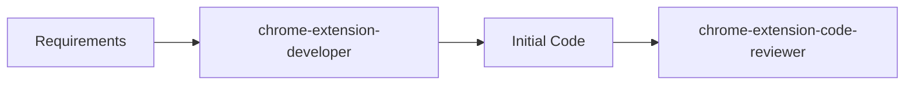
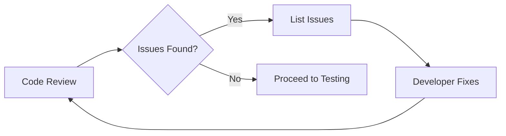
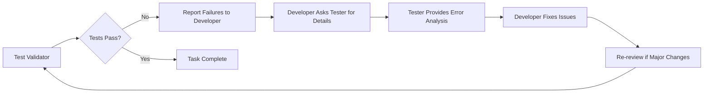
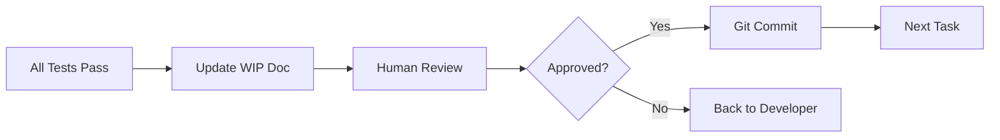

# 🔄 Agent Circular Workflow Instructions

## Overview
This document defines the circular workflow for implementing features using three specialized agents in a continuous improvement loop until all requirements are met.

## 🤖 Agent Roles

### 1. **chrome-extension-developer** 
- **Role**: Primary implementation and bug fixing
- **Input**: Requirements, test failures, error analysis from tester
- **Output**: TypeScript/JavaScript code for Chrome extension features
- **Actions**: 
  - Implements initial code
  - **ASKS tester for error analysis when tests fail**
  - Fixes issues based on tester feedback
  - Repeats asking until all tests pass
- **Triggers next**: chrome-extension-code-reviewer (initial), test-validator (after review)

### 2. **chrome-extension-code-reviewer**
- **Role**: Code quality and requirements validation
- **Input**: Code from developer + original requirements
- **Output**: Critical issues list, improvement suggestions
- **Triggers next**: 
  - Back to developer if issues found
  - Forward to test-validator if approved

### 3. **test-validator-extender**
- **Role**: Test execution, error analysis, and fix guidance
- **Input**: Implemented code + developer questions about failures
- **Output**: 
  - Test results with detailed error messages
  - Root cause analysis when asked by developer
  - Specific fix suggestions and code locations
- **Actions**:
  - Runs tests and reports results
  - **RESPONDS to developer questions about failures**
  - Provides detailed error analysis
  - Suggests specific fixes
- **Triggers next**:
  - Continues dialogue with developer until tests pass
  - Complete only when ALL tests pass

## 📋 Workflow Process

### Phase 1: Initial Implementation


1. **Start**: Feed requirements to chrome-extension-developer
2. **Developer**: Creates initial implementation
3. **Review**: Send code + requirements to code-reviewer

### Phase 2: Review Loop


1. **Review**: Code-reviewer analyzes against requirements
2. **Feedback**: Lists all critical issues
3. **Fix**: Developer addresses ALL issues
4. **Re-review**: Send fixed code back to reviewer
5. **Repeat**: Until NO change feedback remains

### Phase 3: Testing Loop with Developer-Tester Feedback


1. **Test**: test-validator checks implementation
2. **Results**: Reports failing tests with detailed errors
3. **Developer Query**: Developer asks tester for clarification on failures
4. **Tester Analysis**: Tester provides root cause analysis and suggestions
5. **Fix**: Developer implements fixes based on tester feedback
6. **Review**: Code-reviewer validates fixes (only if major changes)
7. **Re-test**: test-validator runs again
8. **Repeat**: Until ALL tests pass - creating a feedback loop

### Phase 4: Completion


1. **Document**: Update WIP document with completion status
2. **Human Review**: Present changes for approval
3. **Commit**: Create git commit for the task
4. **Progress**: Move to next task

## 📄 WIP Document Structure

Create `WIP_IMPLEMENTATION.md` with:

```markdown
# Work In Progress - [Feature Name]

## Current Task: [Task Description]
**Status**: [In Development | In Review | In Testing | Awaiting Human Review | Complete]
**Started**: [Timestamp]
**Current Agent**: [chrome-extension-developer | chrome-extension-code-reviewer | test-validator-extender]

## Requirements
- [ ] Requirement 1
- [ ] Requirement 2
- [ ] ...

## Implementation Progress

### Iteration 1
**Developer Output**: [Summary]
**Reviewer Feedback**: 
- Issue 1
- Issue 2
**Test Results**: N/A

### Iteration 2
**Developer Fixes**: [What was fixed]
**Reviewer Feedback**: No issues
**Test Results**: 
- ❌ Test 1: [Error]
- ✅ Test 2: Passed

### Current Iteration: [N]
[Current status and active work]

## Git Changes
**Modified Files**: 
- file1.ts
- file2.js

**Unstaged Changes**: [git status output]

## Next Steps
1. [Next action item]
2. [Following action]
```

## 🔄 Agent Interaction Protocol

### Passing Information Between Agents

#### Developer → Reviewer
```typescript
{
  "implemented_code": "[code content or file paths]",
  "requirements": "[original requirements]",
  "changes_made": "[summary of changes]",
  "iteration": 1
}
```

#### Reviewer → Developer
```typescript
{
  "critical_issues": [
    "Issue 1: [description]",
    "Issue 2: [description]"
  ],
  "must_fix": true,
  "approved": false
}
```

#### Developer → Test Validator
```typescript
{
  "implementation": "[code or file paths]",
  "feature_description": "[what was implemented]",
  "expected_behavior": "[how it should work]",
  "files_changed": ["file1.ts", "file2.js"]
}
```

#### Test Validator → Developer
```typescript
{
  "test_results": {
    "passed": 5,
    "failed": 2,
    "skipped": 0
  },
  "failures": [
    "Test X: Expected Y but got Z",
    "Test A: Error message"
  ],
  "coverage_gaps": ["Uncovered scenario"],
  "needs_fix": true
}
```

#### Developer → Test Validator (Feedback Request)
```typescript
{
  "request_type": "error_analysis",
  "failed_tests": ["Test X", "Test A"],
  "questions": [
    "What is causing the 'Unsupported BROP command' error?",
    "Where should the command handler be added?"
  ],
  "current_implementation": "[relevant code sections]"
}
```

#### Test Validator → Developer (Error Analysis)
```typescript
{
  "error_analysis": {
    "Test X": {
      "root_cause": "Missing command handler in content.js",
      "fix_location": "content.js line 111 switch statement",
      "suggested_fix": "Add case 'detect_interactive_elements'"
    },
    "Test A": {
      "root_cause": "Function not returning expected format",
      "fix_location": "detectElements() return statement",
      "suggested_fix": "Ensure result matches expected schema"
    }
  },
  "additional_notes": "Check BROP message routing"
}
```

## 🛠️ Implementation Commands

### Step 1: Get Current Git Status
```bash
git status --porcelain
git diff --name-only
```

### Step 2: Start Development Loop with Feedback
```python
# Pseudo-code for the loop with developer-tester feedback
while not all_requirements_met:
    # Developer phase
    code = developer_agent.implement(requirements)
    
    # Review phase
    while has_issues:
        feedback = reviewer_agent.review(code, requirements)
        if feedback.has_issues:
            code = developer_agent.fix(code, feedback)
        else:
            break
    
    # Test phase with feedback loop
    while tests_failing:
        test_results = test_validator.test(code)
        if test_results.has_failures:
            # Developer-Tester Feedback Loop
            error_details = developer_agent.ask_tester(test_results.failures)
            root_cause = test_validator.analyze_errors(error_details)
            fix_suggestions = test_validator.provide_fix_guidance(root_cause)
            
            # Developer implements fixes based on tester feedback
            code = developer_agent.fix(code, fix_suggestions)
            
            # Re-review only if major changes
            if fix_suggestions.requires_review:
                reviewer_agent.review(code, requirements)
        else:
            break
    
    # Update WIP document with feedback history
    update_wip_document(iteration_results, feedback_history)
```

### Step 3: Human Review
```bash
# Show all changes
git diff

# Get human approval
echo "Review changes and approve (y/n):"
```

### Step 4: Commit Changes
```bash
git add [files]
git commit -m "feat: [feature description]

- Implemented [component]
- Added [functionality]
- Tests: [coverage]

Co-authored-by: chrome-extension-developer <agent>
Co-authored-by: chrome-extension-code-reviewer <agent>
Co-authored-by: test-validator-extender <agent>"
```

## 📊 Success Criteria

A task is considered complete when:
1. ✅ All requirements implemented
2. ✅ Zero critical issues from reviewer
3. ✅ All tests passing
4. ✅ Human approval received
5. ✅ Changes committed to git

## 🚫 Failure Handling

If stuck in a loop:
1. Document the blocking issue in WIP
2. Request human intervention
3. Add clarification to requirements
4. Resume workflow with updated context

## 📈 Progress Tracking

Track in WIP document:
- Number of iterations
- Time per iteration
- Issues found and fixed
- Test coverage percentage
- Final implementation summary

## 🔐 Quality Gates

Before moving between agents:
1. **Developer → Reviewer**: Code must compile/run
2. **Reviewer → Test**: No critical issues
3. **Test → Complete**: 100% tests pass
4. **Complete → Commit**: Human approval

## 💡 Best Practices

1. **Small Tasks**: Break large features into smaller tasks
2. **Clear Requirements**: Ensure requirements are specific and testable
3. **Document Everything**: Keep WIP document updated after each iteration
4. **Fix All Issues**: Don't proceed until all feedback is addressed
5. **Test Coverage**: Aim for comprehensive test coverage
6. **Git Hygiene**: One commit per completed task

## 🎯 Example Workflow with Feedback Loop

For the webpage content understanding feature:

1. **Task**: Implement element detection framework
2. **Developer**: Creates detection layers
3. **Reviewer**: Checks against browser-use requirements
4. **Fix**: Address missing detection methods
5. **Re-review**: Confirm all 14 layers present
6. **Test**: Validate detection accuracy
7. **Tests Fail**: "Unsupported BROP command: detect_interactive_elements"
8. **Developer → Tester**: "What's causing this error? Where should I add the handler?"
9. **Tester → Developer**: "Missing command in content.js line 111 switch statement"
10. **Developer**: Adds case 'detect_interactive_elements' to switch
11. **Re-test**: Run tests again
12. **Tests Fail**: "Result format doesn't match expected schema"
13. **Developer → Tester**: "What's the expected format?"
14. **Tester → Developer**: "Need {elements: [], total_detected: N, ...}"
15. **Developer**: Fixes return format
16. **Re-test**: All tests pass ✅
17. **Human Review**: Approve implementation
18. **Commit**: "feat: implement 14-layer element detection framework"

**KEY POINT**: Steps 7-16 show the feedback loop - developer keeps asking tester for help until ALL tests pass

This circular workflow ensures high-quality, fully-tested implementations that meet all requirements before proceeding to the next task.